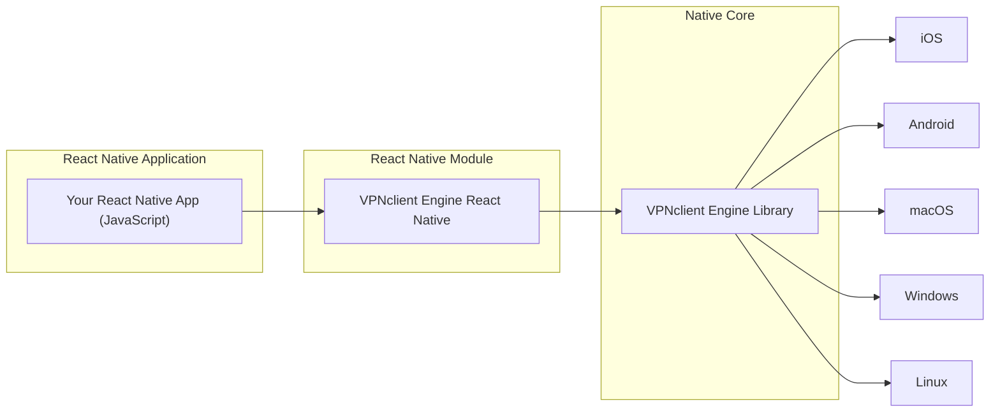

# VPN Client Engine React Native (React Native Module)

Here's a proposed English version of a modified `README.md` for [VPNclient-engine-react-native](https://github.com/VPNclient/VPNclient-engine-react-native), making it clear that Flutter is the main development focus and inviting React Native contributors:

---

## ⚠️ Project Status: Flutter-first

This repository provides a React Native wrapper for [VPNclient Engine](https://github.com/VPNclient/VPNclient-engine).
**However, the main active development is happening in the [Flutter plugin repository](https://github.com/VPNclient/VPNclient-engine-flutter).**

---

## 🤝 Contributing (Call for Contributors)

We are looking for developers interested in maintaining and improving this React Native integration.
If you're passionate about networking, VPN technology, or bridging native code with React Native — we’d love your help!
Feel free to open an issue, start a discussion, or submit a pull request.

---

## 🔗 Related Projects

* Core Engine: [VPNclient-engine](https://github.com/VPNclient/VPNclient-engine)
* Flutter Plugin: [VPNclient-engine-flutter](https://github.com/VPNclient/VPNclient-engine-flutter)
* Example App: [VPNclient-app](https://github.com/VPNclient/VPNclient-app)
  
**VPN Client Engine React Native** is a React Native module that provides a high-level API for controlling VPN connections from a React Native app. It wraps the native [VPNclient Engine](https://github.com/VPNclient/VPNclient-engine) library, allowing React Native developers to integrate advanced VPN functionality into their apps with ease. With this module, you can start and stop VPN connections, switch servers, apply routing rules, and listen to connection events using simple JavaScript calls, without worrying about platform-specific implementation details.

## 🚀 Key Features
- **Seamless Integration:** The module is built to be cross-platform. It uses platform-specific binaries and code (written in C++ and integrated via native modules) to interface with iOS, Android, Windows, macOS, and Linux, but exposes a unified JavaScript interface. This means you write your VPN logic once in JavaScript and it works everywhere React Native does.
- **Intuitive API:** The API is designed with React Native developers in mind. You can initialize the VPN engine, connect to a server, and listen for status changes using promises and event listeners. The module handles asynchronous calls and background threads internally.
- **Powered by VPNclient Engine:** Under the hood, this module utilizes the native VPNclient Engine, which supports multiple protocols (Xray/VMess/VLESS/Reality, WireGuard, OpenVPN, etc.) and drivers. The module abstracts the complexity, so you can, for example, simply call `connect()` and the engine will take care of setting up a tun interface or proxy as needed on that platform.

## 🖥️ Supported Platforms

- ✅ iOS (15.0+)
- ✅ Android (5.0+) 
- ✅ macOS (Intel/Silicon)
- ✅ Windows  
- ✅ Unix (Linux/Debian/Ubuntu)

Each platform uses the native capabilities provided by VPNclient Engine:
- On Android and iOS, the engine uses the system VPN APIs (VpnService, NetworkExtension) to create a VPN tunnel.
- On desktop, it can either create a TUN interface or run as a local proxy (depending on driver configuration).

## 📦 Architecture

Internally, the module acts as a bridge between JavaScript and the native engine. It uses a combination of native modules and platform-specific setup to communicate with the native library. The basic flow:



*Diagram: Your React Native app calls into the VPNclient Engine React Native module (JavaScript layer). The module calls the native VPNclient Engine, which interfaces with the OS networking on each platform.* 

From a developer perspective, you primarily interact with the **JavaScript API** provided by this module. The module takes care of invoking native methods and ensures asynchronous operations (like connecting or disconnecting) do not block the UI thread.

## Platform Setup

Because this module sets up actual VPN tunnels, a few platform-specific configurations are required:

- **Android:** No special code is needed (the module internally uses Android's `VpnService`), but you must declare the following in your app’s AndroidManifest.xml:
  ```xml
  <uses-permission android:name="android.permission.INTERNET" />
  <uses-permission android:name="android.permission.FOREGROUND_SERVICE" />
  ```
  These ensure the app can open network connections and run a foreground service for the VPN. The module will handle launching the VPN service. (Note: You do **not** need to declare `BIND_VPN_SERVICE` in the manifest; the module uses the VpnService class which has that intent filter built-in.)
  
- **iOS:** Enable the Personal VPN capability for your app target in Xcode (this adds the necessary entitlements). Additionally, in your Info.plist, you might need to include a usage description for VPN if required. The VPNclient Engine uses a custom bundle identifier for its network extension (`click.vpnclient.engine` with an `allow-vpn` key), but if you integrate via this module, typically enabling the capability is sufficient. When you run the app the first time, iOS will prompt the user to allow the VPN configuration.
  
- **Windows:** The app should be run with administrator privileges to create a TUN interface via WinTun. Alternatively, have the WinTun driver installed (which is usually present if WireGuard is installed on the system). No manifest changes are needed, but the user might need to approve driver installation if not already present.
  
- **macOS/Linux:** The application will likely require root privileges or proper entitlements to create a tunnel (on macOS, Network Extension needs to be signed with the correct entitlements; on Linux, either run with root or configure `/dev/net/tun` access for the user). For development on macOS, you can enable "Network Extensions" in the sandbox if running unsigned.

Once the above are set up, you can use the module in your JavaScript code as shown below.

## 📥 Getting Started

To start using VPN Client Engine React Native, ensure you have React Native installed and set up your project accordingly.

### 📦 Installation
```sh
npm install vpnclient-engine-react-native
# or
yarn add vpnclient-engine-react-native
```

Then link the native dependencies:
```sh
npx pod-install
```

## 📌 Example Usage

```javascript
import VPNClientEngine from 'vpnclient-engine-react-native';

// Initialize the Engine
VPNClientEngine.initialize();

// Clear subscriptions
VPNClientEngine.clearSubscriptions();

// Add subscription
VPNClientEngine.addSubscription("https://pastebin.com/raw/ZCYiJ98W");
//VPNClientEngine.addSubscriptions(["https://pastebin.com/raw/ZCYiJ98W"]);

// Update subscription
await VPNClientEngine.updateSubscription(0);

// Listen for connection status changes
VPNClientEngine.addListener('onConnectionStatusChanged', (status) => {
  console.log("Connection status:", status);
});

// Connect to server 1
await VPNClientEngine.connect(0, 1);

// Set routing rules
VPNClientEngine.setRoutingRules([
  { appName: "YouTube", action: "proxy" },
  { appName: "google.com", action: "direct" },
  { domain: "ads.com", action: "block" },
]);

// Ping a server
VPNClientEngine.ping(0, 1);
VPNClientEngine.addListener('onPingResult', (result) => {
  console.log(`Ping: sub=${result.subscriptionIndex}, server=${result.serverIndex}, latency=${result.latencyInMs} ms`);
});

setTimeout(async () => {
  // Disconnect
  await VPNClientEngine.disconnect();
}, 10000);
```

---

## ⚙️ API Methods

### 🔹 1. initialize()
Initializes the VPN Client Engine. This should be called before using any other method.

### 🔹 2. connect(subscriptionIndex: number, serverIndex: number)
Connects to the specified VPN server.
- `subscriptionIndex`: Index of the subscription.
- `serverIndex`: Index of the server from the subscription.

### 🔹 3. disconnect()
Disconnects the active VPN connection.

### 🔹 4. getConnectionStatus()
Returns the current connection status (`connected`, `disconnected`, `connecting`, `error`).

### 🔹 5. getServerList(subscriptionIndex: number)
Fetches the list of available VPN servers for a subscription.

### 🔹 6. pingServer(subscriptionIndex: number, serverIndex: number)
Pings a specific server to check latency.
- Returns: Promise with latency in milliseconds.

### 🔹 7. setRoutingRules(rules: RoutingRule[])
Configures routing rules for apps or domains.
- `rules`: Array of routing rules (e.g., route YouTube traffic through VPN, block ads.com).

### 🔹 8. addSubscription(url: string)
Adds a VPN subscription from the provided URL.

### 🔹 9. addSubscriptions(urls: string[])
Adds multiple VPN subscriptions from the provided URLs.

### 🔹 10. updateSubscription(subscriptionIndex: number)
Updates the subscription at the given index.

### 🔹 11. clearSubscriptions()
Clears all subscriptions.

### 🔹 12. getSessionStatistics()
Returns statistics for the current VPN session (e.g., data usage, session duration).

### 🔹 13. setAutoConnect(enable: boolean)
Enables or disables auto-connect functionality.

### 🔹 14. setKillSwitch(enable: boolean)
Enables or disables the kill switch.

---

## 🔔 Events

Use `addListener` and `removeListener` to handle events:

### 📡 1. onConnectionStatusChanged
Triggered when VPN connection status changes.
- Payload: `status` (e.g., `connected`, `disconnected`, `error`).

### ⚠️ 2. onError
Triggered when an error occurs.
- Payload: `errorCode` and `errorMessage`.

### 🔄 3. onServerSwitched
Triggered when the VPN server is switched.
- Payload: `newServerAddress`.

### 📊 4. onPingResult
Triggered when a ping operation completes.
- Payload: `subscriptionIndex`, `serverIndex`, and `latencyInMs`.

### 🔑 5. onSubscriptionLoaded
Triggered when a subscription is loaded successfully.
- Payload: `subscriptionDetails`.

### 📈 6. onDataUsageUpdated
Triggered periodically with updated data usage statistics.
- Payload: `dataUsed` and `dataRemaining`.

### 📌 7. onRoutingRulesApplied
Triggered when routing rules are applied.
- Payload: Array of `RoutingRule`.

### 🚨 8. onKillSwitchTriggered
Triggered when the kill switch is activated.

---

## 📂 Type Definitions

```typescript
type ConnectionStatus = 'connecting' | 'connected' | 'disconnected' | 'error';

interface Server {
  address: string;
  latency: number;
  location: string;
  isPreferred: boolean;
}

interface RoutingRule {
  appName?: string;
  domain?: string;
  action: 'block' | 'allow' | 'proxy';
}

interface PingResult {
  subscriptionIndex: number;
  serverIndex: number;
  latencyInMs: number;
}

interface SubscriptionDetails {
  expiryDate: string;
  dataLimit: number;
  usedData: number;
}
```

---

## 📜 License

This project is licensed under the **VPNclient Extended GNU General Public License v3 (GPL v3)**. See [LICENSE.md](LICENSE.md) for details.

⚠️ **Note:** By using this software, you agree to comply with additional conditions outlined in the [VPNсlient Extended GNU General Public License v3 (GPL v3)](LICENSE.md)

## 💬 Support
For issues or questions, please open an issue on our GitHub repository.
